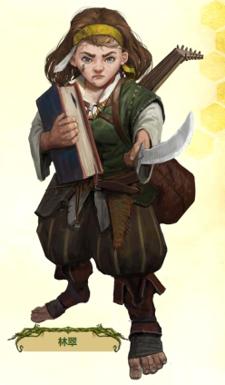

# 林翠

---

---

- 种族:半身人
- 性别:女
- 阵营:混乱善良
- 信仰:莎琳
- 年龄:？？
- 职业:吟游诗人
- 语言:通用语，半身人语，哈利特语

---

## 属性

- 力量:种族-1
- 敏捷:种族1+自选1+背景1
- 体质:自选1
- 智力:自选1
- 感知:种族1
- 魅力:种族1+职业1+自选1+背景1

---

## 防御

- HP15/15(1HD):种族6+职业8\*1+体质1\*1=15
- AC17=基础10+等级1+受训2+物品1+敏捷3
- 强韧4=等级1+受训2+体质1
- 反射6=等级1+受训2+敏捷3
- 意志6=等级1+专家4+感知1

---

## 进攻

- 察觉6=等级1+专家4+感知1
- 隐匿6=等级1+受训2+敏捷3
- 移动速度25=种族25
- ab6=等级1+受训2+敏捷3
- 近战 [A] 细剑+6（致命 D8，缴械，娴熟），伤害 1D6-1 穿刺
- 远程 [A] 短弓+6（致命 D10，射程 60 尺），伤害 1D6 穿刺
- 异能自发法术 DC 17，攻击+7；1 环 墨水喷射，安抚术，克敌机先；戏法（1 环）幻音术，光亮术，法师之手，阅读灵光，念动射弹
- 诗人组曲法术 1 聚能点，DC 17；1 环 反制表演；戏法（1环）激发勇气
---

## 吟游诗人

### 吟游诗人施法  
　　你利用艰深晦涩的知识来施法。你成为了一名施法者并且可以通过施放法术行动来施放异能法术。作为吟游诗人，当你施放法术时，你的施法咒语可能会是魔法的和弦或诙谐的韵诗，而你的施法姿势则可能结合了舞蹈与夸张的哑剧手语，同时作为诗人，你的施法动作很有可能伴随着演奏魔法乐器。  
　　你每天可以施放至多两个1环法术。你只能施放你已知的法术，并且可以通过法术库职业特性进行学习。你每天可以施放的法术数量被称作法术位。  
　　当你的吟游诗人等级提升时，你每日可以施放的法术以及你可以施放的最高法术环位也会增加，详见表：吟游诗人每日法术。  
　　你的有些法术需要你尝试一次法术攻击检定，或者需要敌人掷骰对抗你的法术DC（典型情况是尝试一次豁免掷骰）来决定它们具体产生的效果。由于你的关键属性是魅力，你的法术攻击调整和法术DC使用你的魅力调整值。计算这些数据的详细内容见第八章：检定。  

升阶法术  
　　当你获得2环或更高的法术位时，你可以在这些法术位中填充低环法术的更强版本。这会提高此法术的环级，将其升阶至与法术位环级相同。为了将法术升阶至你想要的环级，该环级的该法术必须在你的法术库中。许多法术在升阶至特定环级施放时会具有特定的效果提升。标志性法术特性能让你自由升阶特定法术。

戏法  
　　你的法术中有些是戏法。戏法是一种特殊的法术，无需消耗法术位来施放。你可以任意施放戏法，每日不限次数。戏法总会升阶到你等级的一半，向上取整——通常而言与你最高的吟游诗人法术位的环级相等。举例而言，对于一名1级吟游诗人，你的戏法是1环法术，而5级吟游诗人则是3环。

### 初始熟练

1级时，你在下面这些数据上获得所列的熟练度。你在任何未列出的项目上都是未受训，除非你通过其它方式获得了更高的熟练度。

察觉  
在察觉上为专家

豁免骰  
在强韧上为受训  
在反射上为受训  
在意志上为专家

技能  
在神秘上达到受训  
在表演上达到受训  
在数量等于4+你智力调整值的额外技能上受训

攻击  
在简易武器上为受训  
在军用武器上为受训  
在无武装攻击上为受训

防御  
在轻甲上受训  
在无甲防御上受训

法术  
在法术攻击调整上受训  
在法术DC上受训

职业DC  
在吟游诗人职业DC上受训

### 法术库 Spell Repertoire
　　你可以施放的法术集合被称为法术库。在1级时，你学会由你选择的两个1环异能法术以及五个异能戏法。你可以选择异能法术列表中的常见法术，或者当你拥有许可时也可以选择其它异能法术。你可以使用对应环级的法术位来施放法术库中的任意法术。  
　　在你提升等级的时候也会扩充法术库。每当你获得一个法术位（见吟游诗人每日法术表），你可以将一个同环级法术加入法术库。在2级时，你选择另一个1环法术；在3级时，你选择两个2环法术，依此类推。当你添加法术时，你也能添加一个已有法术的高环版本，从而让你可以升环施放该法术。  
　　尽管获取速度相同，但你的法术位与法术库中的法术是彼此独立的。如果某专长或其它能力将法术加入你的法术库中，它并不会同时赋予你对应的法术位，反之亦然。  

替换法术库中的法术  
　　当你在法术库中获得新的法术时，你可能会想要替换之前学习的一些法术。每次你获得新的等级学习新的法术时，你可以将一个旧法术置换为一个同一环级的不同法术。被替换的法术可以是戏法。你也可以通过休整期重训来替换法术。

## 组曲法术 Composition Spells
　　你可以将表演融合到法术当中来创造名为组曲法术的独特效果。组曲法术是一种特殊的法术类型，通常要求你在施放的时候使用表演技能。  
　　组曲法术是一种聚能法术。施放聚能法术需要消耗1个聚能点；你的初始聚能池中拥有1个聚能点。你在每日准备时重新填满聚能池，也可以通过花费10分钟来表演、书写新的组曲或与你的缪斯交流，使用再聚能行动恢复1个聚能点。  
　　和戏法一样，聚能法术会自动升阶到你等级的一半，向上取整。聚能法术无需也无法使用法术位施放。你聚能池中的最大聚能点等同于你掌握的聚能法术数量，但上限为3点。关于聚能法术的完整规则在第七章给出。  
　　你获得反制表演组曲法术，保护你免受视觉和听觉效果。

组曲戏法  
　　组曲戏法是一种不消耗聚能点的特殊组曲法术，因此你可以随意使用它们。组曲戏法是你从异能列表选择的戏法以外的戏法。通常情况下只有专长才能让你获得更多的组曲戏法。与其他戏法不同，你不能在之后的等级中替换专长给予的组曲戏法，除非通过重训替换特定的专长。  
　　你获得英勇颂歌组曲戏法，提升你和盟友的攻击、伤害以及对恐惧效应的防御能力。

### 族裔

生命值  
6

体型  
小型

速度  
25尺

属性提升  
敏捷、感知、自选

属性缺陷  
力量

语言  
通用语、半身人语、外加数量等同于智力调整值（若为正值）的额外语言，从以下语言中选择：矮人语、精灵语、侏儒语、地精语、以及任何其它你拥有许可的语言（例如你所在地区的通行语言）。

特征  
半身人 类人

锐眼  
敏锐的眼神让你能发现其他人注意不到的隐蔽甚至隐形生物的蛛丝马迹。在寻找你自身30尺范围内的藏匿与无踪生物的搜索检定上，你获得+2环境加值。当你瞄准对你而言隐蔽或藏匿的敌人时，瞄准前者的纯骰检定DC降低至3，后者降低至9。

#### 族裔传承(半身人)

无畏半身人(Gutsy Halfling)

你的家族因在危急时刻保持冷静且毫不畏惧而闻名。当你在对抗情绪效果的豁免检定中成功时，将结果改为大成功。

### 背景

#### 背景故事

说书人琳翠几年前离开了伽尔特，打算在传说中的皮塔克斯地区完善自己的技艺。然而，不久之后她就意识到皮塔克斯作为艺术中心的声誉多数来源于宣传而并非真实。虽然她能感觉到这座城市的工匠们在努力创作原创作品，但在伊洛维提国王高压统治的镇压和干预下，这件事情变得难上加难。琳翠在皮塔克斯没能获知新的故事，但是她学到了抵抗和叛逆的价值。这些主题不可避免地渗入了她的作品之中，但当她写下的一首有关伊洛维提国王的粗俗打油诗出人意料地流行起来之后，她也因“大不敬”的罪名遭到了流放。

琳翠没有气馁。她觉得自己已经在皮塔克斯学到了足够多的东西，于是她带着新的目标向东进发：寻找伟大的英雄，让他们成为自己心目中杰出作品的创作灵感，那将会是一部扣人心弦的冒险故事，讲述了英雄面对最最邪恶的事物最终战胜它们的故事。她一路旅行，最终来到了布雷斡的腹地，她在那里听说嘉曼蒂·奥多里女士正在广发英雄帖。琳翠意识到，这就是她一直等待着的机会！

#### 背景特性

艺术家(Artist)

无论形式为何，你的艺术都承载了你最大的热情。冒险可能会帮你找到灵感，或者它仅仅是在你成为世界闻名的艺术家前的一种谋生方式。

选择两项属性提升。一项必须是敏捷或魅力，另一项为自选属性提升。

你在手艺技能和艺术（Art）学识技能上受训。你获得独门手艺技能专长。

## 专长
### 族裔专长

半身人幸运(Halfling Luck)

幸运 半身人  
触发 你在一次技能或豁免检定中失败。  
频率 每日一次  
你无忧无虑的乐观天性让人觉得不幸会对你绕道而行，在某种程度上来说，这或许是真的。你可以重投触发检定，但你必须采用新的结果，哪怕它比第一次更糟。

### 职业专长

逸闻知识(Bardic Lore)

常见 吟游诗人  
先决条件 谜团缪斯  
你通过研习，对所有知识课题都有所涉猎。你在逸闻知识上受训，这是一种只能用来回忆知识，但是回想主题可以为任意的特殊学识技能。如果你在神秘学技能上拥有传奇熟练，你获得逸闻知识的专家熟练，但是你没有办法通过任何其他方式提升逸闻知识熟练等级。

### 技能专长

独门手艺(Specialty Crafting)-艺术

 
通用 技能  
先决条件 手艺技能受训  
你针对某一类物品磨练自己的制作技艺。选择下表列出的一种专精类型，在制作该类物品时，你的手艺检定获得+1环境加值。若你在手艺技能上的熟练度达到大师，该加值提高到+2。对于无法明确是否可应用专精效果的情况，交由GM决定。某些专精效果或许只能部分生效。例如，如果你在制作一把钉头锤，且专精类型为木工，GM或许会给你一半加值，因为它同时需要用到锻造和木工两种手艺。  
　　专精类型　　　 适用物品  
　　炼金术* 　　　灵药等炼金物品　　　  
　　艺术 　　　　　精美艺术品，包括珠宝首饰　　　  
　　锻造 　　　　　耐用的金属制品，包括金属护甲　　　  
　　书籍制作 　　　书本和纸张　　　  
　　玻璃制作 　　　玻璃，包括玻璃器皿和窗玻璃　　　  
　　制皮 　　　　　皮革制品，包括皮甲　　　  
　　陶艺 　　　　　陶瓷制品　　　  
　　造船 　　　　　大小船只　　　  
　　石工 　　　　　石头制品和石造建筑　　　  
　　裁缝 　　　　　衣物　　　  
　　编织 　　　　　纺织品、篮筐、地毯　　　  
　　木工 　　　　　精木制品和木造建筑　　　  
　　*　需要有“炼金手艺”才能制作。

---

## 技能

受训:特技+6（受训），艺术学识+4（受训），逸闻知识+4（受训），手艺+4（受训），欺骗+7（受训），交涉+7（受训），神秘+4（受训），表演+7（受训），社群+4（受训），隐秘+6（受训）

专家:

大师:

- 特技	敏捷6=等级1+受训2+敏捷3			保持平衡	翻滚 	空中机动 　挤入E
- 奥法	智力1=智力1			回忆知识G	借阅奥术E　解译文书E,G　辨识魔法E,G　学习法术E,G
- 运动	力量-1=力量-1					攀爬 　破拆 　擒拿 　跳高 　跳远 　推撞 　移位 　游泳 　摔绊 	卸武
- 手艺	智力4=等级1+受训2+智力1			回忆知识G 　修理E	制作D　赚取收入D,G　辨识炼金术E
- 欺骗	魅力7=等级1+受训2+魅力4							分神 　乔装E　说谎	虚招
- 交涉	魅力7=等级1+受训2+魅力4							搜集信息E　建立印象E　请求
- 威吓	魅力4=魅力4							胁迫E　挫败士气
- 学识	智力4=等级1+受训2+智力1			回忆知识G 	赚取收入D,G
- 医疗	感知1=感知1	急救 　回忆知识G 	治疗疾病D　治疗中毒 　治疗伤势E
- 自然	感知1=感知1							指挥动物 　回忆知识G 	辨识魔法E,G　学习法术E,G
- 神秘	智力4=等级1+受训2+智力1		回忆知识G 	解译文书E,G　辨识魔法E,G　学习法术E,G
- 表演	魅力7=等级1+受训2+魅力4							演出 	赚取收入D,G
- 宗教	感知1=感知1			回忆知识G 	解译文书E,G　辨识魔法E,G　学习法术E,G
- 社群	智力4=等级1+受训2+智力1			回忆知识G 　求生D,G	伪造文书D　解译文书E,G
- 隐秘	敏捷6=等级1+受训2+敏捷3			隐藏物件 　躲藏 　潜行 	-
- 生存	感知1=感知1			辨别方向E　求生D,G	掩盖行踪E　追踪E
- 贼活	敏捷3=敏捷3			手上功夫 　盗窃 	解除装置 　开锁

---

## 加点

1	族裔和背景，属性提升，吟游诗人施法，初始熟练，法术库，组曲法术，缪斯  
2	吟游诗人专长，技能专长  
3	2环法术，通用专长，反射专家，标志性法术，技能提升  
4	吟游诗人专长，技能专长  
5	3环法术，属性提升，族裔专长，技能提升  
6	吟游诗人专长，技能专长  
7	4环法术，专家施法者，通用专长，技能提升  
8	吟游诗人专长，技能专长  
9	5环法术，族裔专长，强韧专家，演员之心，技能提升  
10	属性提升，吟游诗人专长，技能专长  
11	6环法术，诗人武器专家，通用专长，技能提升，警惕感官  
12	吟游诗人专长，技能专长  
13	7环法术，族裔专长，轻甲专家，技能提升，武器专精  
14	吟游诗人专长，技能专长  
15	8环法术，属性提升，通用专长，大师施法者，技能提升  
16	吟游诗人专长，技能专长  
17	9环法术，族裔专长，高等演员之心，技能提升  
18	吟游诗人专长，技能专长  
19	通用专长，传奇施法者，代表作，技能提升  
20	属性提升，吟游诗人专长，技能专长  

## 物品
背包，燧石和铁片，翡翠猫护符，日记，鲁特琴，缟玛瑙黑豹，布甲，细剑，干粮（1 周），短弓，水袋，书写套件
