# 大地图移动

定义术语：队伍察觉，指队伍察觉加值最高的生物的察觉取10。队伍隐匿，指队伍隐匿加值最低的生物的隐匿取10。队伍速度，指队伍移动速度最慢的生物的动作能移动/飞行的距离。

队伍在大地图上每个白天拥有的行动力点数为：队伍速度每10尺1点，不足1点不计。

进入一个新地格需要消耗行动力，正常地形消耗1点，复杂地形（山区、树林、水域）消耗2点。何为复杂地形以GM为准。

队伍可以声明消耗1行动力搜索当前格的区域。GM会用'队伍察觉'比对秘密的DC来决定是否遇到该格中需察觉的目标（但GM不会声明该格内是否真的有需要察觉的目标）。一个地区也许不止有1个需要察觉的目标。一个效果想调整此察觉加值，它必须至少存在(8小时/队伍每日行动点数，不取整)。

队伍可以声明消耗20行动力仔细搜索某一地区改为取20。

进入一个地格时，以及在一个地格内取20搜索时的每新的一天，可能按随机遭遇表产生随机遭遇，产生概率暂时设置为20%。如果随机遭遇表格产生的遭遇过于简单(XP<=80)，跳过该遭遇但不获得奖励（固定的剧情遭遇不会以此法跳过）。

许多关于大地图的情报会（在难以预料的时机的）剧情或对话中给出，产生的效应包括但不限于：了解某些地区的参考CR；某些察觉对象可以在获得线索后自动通过。

一片地区的随机遭遇表格（包括是否有随机遭遇的概率）可以主动呼叫骰社群了解。基本DC公式为2*CR+15，此结果需暗骰以避免在未通过检定时泄露实际CR。此公式不适用于了解某些特殊遭遇（即'在传闻、书籍和本地人那里都打听不到的事情'）。例如：镇子东边那片山区在D20投出1-10时没有遭遇，投出11-20时遭遇两个强盗，遭遇CR是3。但实际上还存在没人知道的睡了100年刚睡醒的蓝色的熊，会在投出10时遭遇，遭遇CR是10。

两方'正常'在野外相遇时，谁先注意到另一方由（队伍A察觉-队伍B隐匿）和（队伍B察觉-队伍A隐匿）何者较大决定。遭遇的距离将由dm暗骰确定，并保持在一个相对合理的范围内。(D6+30)

警告：失窃之地的某些地区非常危险..

# 罗斯特兰腹地(RL)随机遭遇表 

 xp计算相对于1级

荆棘河强盗\*3  增加一个精英调整模板 xp120  
狐尾袋狼\*2  xp120  
偷猎者\*2  xp120  
麋鹿\*2  增加一个精英调整模板 xp120  
狼\*2  增加一个精英调整模板 xp120  
野猪\*2  xp120  
袋狼\*3  增加一个精英调整模板 xp120  
灰熊\*1  增加一个精英调整模板 xp120  

精英调整模板 

# 地标位置
BV1 雷斯托夫 (1,2)  
BV2 尼瓦克塔十字路口 (3,2)  
RL1 奥列格商栈 (9,2)  
RL2 博肯的小屋 (7,2)  
RL3 蜘蛛巢穴 (7,3)  
RL4 曲水瀑布 (5,2)  
RL5 谢连科堡 (5,3)  
RL6 贵族的死尸 (3,3) 秘密(本节不会出现)

# BV1 雷斯托夫 (1,2)
无剧情，仅提供购物。  
在出发之前你们了解到在罗斯特兰腹地目前唯一尚存的文明据点就是地图上(9,2)的奥列格贸易站，那里还处于失窃之地的边缘，布雷沃的法律尚存的地区。

# BV2 尼瓦克塔十字路口 (3,2)
无剧情。  
林翠：“从这里在往前就是荒野了，也许我们会在路上遇到什么奇妙的遭遇呢。”

# RL4 曲水瀑布 (5,2)
伯劳河（Shrike River）在此处顺着一系列小型瀑布倾泻而下，每段瀑布的高度都有 10 至 30 尺。在这 1 英里的航程内一共有 5 个瀑布——曲水河（Crooked River）支流在这一系列瀑布的中间汇入伯劳河。这些瀑布（以及区域 GB10内规模更大的伯劳瀑布）使得伯劳河难以成为布雷斡连接南方的贸易路线，因此水运商路会沿着东塞伦河向西穿过钩舌泥沼——然而这条路线在近期变得十分凶险（更多信息请见本书第七章）。沿着这些瀑布的边沿向上攀登需要通过 DC 20 的运动检定才能攀爬）。

# RL5 谢连科堡 (5,3)
这座木造工事在布雷斡的南部边境已经矗立多年，但随着罗斯特兰和以西亚之间日渐加剧的紧张关系，曾经驻扎在这里的士兵和斥候都被雷斯托夫召了。堡垒内已经被净空，对此地进行的任何调查都会表明该地被迅速且有序地抛弃了。

# RL2 博肯的小屋 (7,2)
生物：尽管绿野远远说不上安全，但有些人就是喜欢这种与世隔绝的地方，其中也包括古怪的药剂师博肯（Bokken；CN 男性人类 炼金术士 4 级）。博肯的举止就好像受惊的鸟儿或者神经紧张的孩子一般，他的语速很快但内容简明，就好像他急于结束每段由自己开启的对话一样。不过博肯并不讨厌黄金，他也渴望把自己的药剂销售出去，本区域内的许多旅人都知道这件事，通常来说他会直接把产品卖给奥列格，但如果 PC 们找上门来，他也不介意卖给他们。他通常会保持家里储存着2瓶下等治疗药水 （ fire resistance）、2 瓶次等治疗药水（lesser healing potions）、1 瓶中等治疗药水（moderate healing potion）、1 瓶次等火焰抗力药水（lesser potion of fire resistance）和 1 瓶次等寒冷抗力药水（lesser potion of cold resistance）。  
在与博肯的任何深入交谈中，他都有可能提及自己的弟弟柯缪（Kurmil）。博肯会啐一口吐沫然后大声咒骂，愤怒地举起右手展示他失去的小拇指。“这就是那混球在以前揍我家老娘时候给我砍断的，愿黛丝娜让我娘安息。不过那家伙为了躲避卫兵逃到南方的空心树里过日子了，这事儿也就这样了吧。”博肯在弟弟出走且父母离世数年后决定成为一名隐士。起初，他曾经考虑去找自己的弟弟寻仇，但绿野出没的野生生物过于可怕和危险，因此他选择在罗斯特兰的边缘地带定居，在大自然中度过余生。
然后交谈过后会发布一个任务：

搜集牙莓果 GATHERING FANGBERRIES  
[30XP]  
博肯懂得让药水变得美味可口的方法。他的药水如此美味的秘密就是牙莓果汁（fangberry juice），但这种物资的储备快用光了。奥列格商栈西南方约 55 英里处生长着一大片牙莓果，他需要找个精明强健的家伙帮他采集这种植物。（乐于助人的 PC 们可能会希望在交付莓果之前把这些果实洗干净；因为博肯在制药时可不会预先费心清洗这些东西。）  
任务源：博肯（区域 RL2）  
完成条件：给博肯带来满满一篮子莓果——这些果子作出的牙莓果汁足够用来制作 7 瓶药剂
奖励：博肯在 3 个月内对 PC 们销售药剂时会打七五折（25%折扣）。

GB18.牙莓果灌木丛(8,6)

此外还会提及(7.3)位置有一个蜘蛛巢穴

# RL3 蜘蛛巢穴 (7,3)
2只蜘蛛，场地被蛛网铺满。蛛网可以提供掩蔽。
充满蛛网的方格属于困难地形。每当蛛网中的一个生物使用移动动作、或者在移动动作中进入蛛网时，它都必须进行一次对抗你法术DC的运动检定或者反射豁免，否则其速度会受到环境减值甚至被禁足。离开蛛网的生物不再承受来自蛛网的速度环境减值。  
进行一次至少造成5点挥砍伤害或1点火焰伤害的攻击或效果就可以清除一格蛛网。每格蛛网具有5点AC，蛛网的豁免检定会自动失败。  
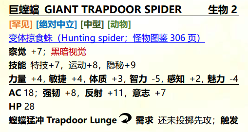

宝藏：尽管蜘蛛经常清理巢穴周围 20 尺范围内的骸骨，但它已经有一个多星期没有这么做了，因此还有几具尸体留在那边，这包括一具身穿皮甲携带短剑和 10gp 的强盗尸体。他还佩戴着价值 3gp 的银质鹿王护符。不过更让人感兴趣的是塞在他左脚靴子里的一张纸条，上面画着一颗已经枯死、形似爪子的树，这棵树位于一座贫瘠的山丘上，树根旁边画着一个“X”图案。这张粗糙的地图为区域 GB9 的老树之下埋藏的宝物提供了线索。

# RL1 奥列格商栈

新的一队冒险者来的消息很快吸引了这个贸易站里的另外几人。你们看到一对大约30来岁的夫妇。

当 PC 们到达时，斯威特拉娜热情地迎接了他们，并且
送上了丰盛的炖菜和热面包，她甚至还开了一瓶酒来感谢他
们的帮助。  
“我最近得到消息说是会有一队守卫来帮助我们，相比就是你们了吧。”  
“你们来的时间真是巧妙呢，明天早上正是那群强盗这个月要来的日子。如果你们愿意帮助我们，我们愿意提供免费的住宿。”
他最近得到消息说将有一队守卫会来帮助他，但至今仍没有任何迹象表明这种保护的到来，而强盗们依旧每月都会来一次商栈。

首次造访：强盗们第一次造访是在三个月前——他们威胁说，如果列维顿夫妇不同意交出他们从各个猎人和捕兽者手中收集到的皮草和货物，便会烧毁商栈。  
后续造访：从那以后，强盗们又来了两次，每次都是在每月第一天日出后的一个小时内。列维顿夫妇已经学会了把他们的“税”准备好，并且迅速上缴——强盗们似乎总是急于往南进入绿野返回他们的营地，这让斯威特拉娜认为他们的营地离开此处只有莫约一天的骑程。  
强盗数量：强盗们第一次来的时候，足有一打人——由一个手持弓箭的兜帽男和一个携有双斧的女人带领着 10 个低阶犯罪者。在第一次见面时，大部分的话都说那个女人说的，她邪恶的幽默感再加上她在谈到如果列维顿夫妇不听话而所将面对的命运时这个女人脸上所露出的微小，都让他们两个更感到害怕。那个女人似乎特别敏锐且善于观察，而那个男人似乎更加粗鲁和愚笨一些。这一点，再加上这个女人带着残忍的嘲笑挥起短柄斧几乎就要砍掉了奥列格的右手，更使列维顿夫妇确信她是最危险的强盗。最后，这个女人从斯威特拉娜的手指上抢过了她的婚戒抛给了她的一个人，作为“没有缩短奥列格够得着的高度”的报酬。  
在第二和第三次造访时，只有那个粗鲁的兜帽男陪着那些强盗。在第二次造访时他只带了六个人，而在第三次造访时他仅仅带了四个。列维顿夫妇怀疑强盗们已经放松了警惕，认为商栈的老板被完全吓住了。希望在他们明天到来时人数会更少，那个拿着短柄斧的可怕女人不会和他们在一起！  
伏击强盗 中等威胁 1  
XP预算180  
哈普斯·拜顿 XP120 hp42
增加2个精英调整模板

精英调整模板 
荆棘河强盗\*3 XP60 hp18 增加1个精英调整模板

PC 们有当天剩下的时间外加一个晚上来建立他们的防御工事来为强盗们即将到来的造访进行准备。列维顿夫妇建议 PC 们躲在客房或马厩里，等强盗们忙着把皮草和其他物品装到他们的马上时，PC 们就能从藏身处里冲出来攻击他们。  
列维顿夫妇对这些折磨他们的人毫无怜悯，希望看到他们全都死完。奥列格甚至计划把强盗的尸体挂在南边的栅栏墙上，作为对其他强盗的警告。尽管如此，奥列格强调说，他的他的妻子都不是战士，不会协助任何会将他们或者商栈推向额外危险的计划，或者至少也不会让强盗去别处寻找更容易下手的受害者。给予 PC 们足够的时间来制定他们的伏击计划，允许他们探索商栈，想出如何利用在这所发现的补给和建筑物。  

PC 们有当天剩下的时间外加一个晚上来建立他们的防御工事来为强盗们即将到来的造访进行准备。列维顿夫妇建议 PC 们躲在客房或马厩里，等强盗们忙着把皮草和其他物品装到他们的马上时，PC 们就能从藏身处里冲出来攻击他们。

完成击败强盗的任务后允许做任务

“哦，既然你们有这么大的野心，不妨也看看那边墙边的公告栏，都是随机的布雷沃人贴上去的，有几条已经有些年头了，也不知道悬赏还做不做数。”

“总之这片地区前些年死了很多冒险者，最近没什么人敢来了。愿意做这些任务奖励大概都是你们的。”

在贸易站购物：总是能够出售任何 PC 们能够负担得起，且核心规则书中列出的常见武器、护甲和装备。若角色希望购买更加稀有的物品，能订下一份特殊订单，该物品将会在 2d6+4 日内上架。

悬赏：狗头人 WANTED: KOBOLDS  
[30XP]  
煤鳞狗头人生活在绿野的某个山丘的洞穴中。他们一般来说不会成为麻烦，但最近他们似乎被什么事情惹怒了。找到煤鳞的巢穴，确保这些狗头人不会构成威胁。  
任务源：悬赏单  
完成条件：杀死狗头人、与他们缔结和平协定、或与其结盟奖励：PC 们保证狗头人的活动受到控制大约一星期后，剑爵会给 PC 们发放 40gp 的赏金  

悬赏：獠牙破膛手 WANTED: TUSKGUTTER  
[10XP]  
每个绿野的猎人都知道獠牙破膛手（Tuskgutter）的故事，绿野最惹人生厌的野猪。无论谁能设法杀死这头脾气暴躁的野兽，都能得到隐退猎人维凯·本曾（Vekkel Benzen）提供的丰厚报酬，这头怪猪在一年前欠了他一条腿。  
任务源：悬赏单  
完成条件：把獠牙破膛手的头颅交给奥列格，这样维凯就可以对着这头蠢猪的眼睛吐口水了！  
奖励：维凯承诺把他的复合长弓和三发信标箭矢（beacon shot arrows）赠予杀死獠牙破膛手的人。他还承诺分享用这份战利品制作的美味猪头肉冻。 (改成+1复合长弓)

悬赏：强盗 WANTED: BANDITS  
[30XP]  
必须向强盗们公示，让他们明白劫掠行为不会得到容忍。通过杀死或逮捕数量足够多的强盗来向他们的首领传达这条信息。  
任务源：悬赏单  
完成条件：击败六名或更多的强盗，杀死（需要提供死亡证明）或将其捕获并送往奥列格商栈。在奥列格商栈与哈普斯（Happs）及其匪徒伙伴发生的初次遭遇不算在此列奖励：在逮捕第六个强盗一星期后，剑爵会给 PC 们发放30gp 的赏金

同时你们英勇的表现让列维顿开始向你们请求帮助。

奥列格的战利品装饰 OLEG’S TROPHY  
[10XP]  
从人们谈论泰兹尔亚龙的方式来看，你可能会认为这种生物无处不在。但事实并非如此；泰兹尔亚龙实际上十分罕见。泰兹尔亚龙的头颅装饰放在奥列格的店内一定会成为人们讨论的话题，因此他承诺对带来这项战利品的人提供奖励。  
任务源：奥列格·列维顿（区域 RL1）  
完成条件：杀死一只泰兹尔亚龙并把它的头颅完好地带回奖励：奥列格会把他的 5 个情人节（lover’s knots；详见附录 4）赠予带来泰兹尔亚龙头颅的 PC 们

萝卜汤 RADISH SOUP  
[10XP]  
奥列格最近负担的压力很大，因此斯威特拉娜想通过为他烹饪他最喜欢的料理——月萝卜汤——来让他放松。斯威特拉娜所知道的能够采集到月萝卜的最近地点为商栈以南 16 英里的地方，但她已经有好几个月没去过那里了。  
任务源：奥列格·列维顿（区域 RL1）  
完成条件：从区域 GB4 采来一篮子月萝卜（moon radishes）给斯威特拉娜  
奖励：斯威特拉娜会为带来足量月萝卜的人支付 15gp。若PC 们在奥列格商栈过夜，她会为每个帮忙的人做一碗月萝卜汤。在此之后，PC 们可以以正常价格购买额外一份月萝卜汤（附录 4 中提供了关于这种美味餐食的详细信息）。

斯威特拉娜的戒指 SVETLANA’S RING  
[30XP]  
尽管斯威特拉娜声称和强盗们有可能夺走的东西相比，失去戒指并不是什么多大的损失，但奥列格知道婚戒失窃的事情让他的妻子十分苦恼。她禁止奥列格冒着失去生命的危险去寻找戒指，但如果有人能把戒指带回来的话，奥列格将会十分感谢对方。就两人所知，戒指最后落入了强盗手中，但他们很可能已经把戒指丢掉或卖掉了。  
任务源：奥列格·列维顿（区域 RL1）  
完成条件：找到戒指并把它带给奥列格  
奖励：奥列格承诺，如果能把他妻子的戒指找回来，将会提供在商栈抵用 50gp 的信用额度 改为50gp

## 凯斯腾·盖雷斯抵达
当 PC 们帮助奥列格商栈免遭强盗洗劫之后，开始在失窃之地探索，但却在他们再次返回到商栈之前的某个时点，凯斯腾·盖雷斯（Kesten Garess；CN 男性 战士 3 级）带着3 名由他指挥的 1 级佣兵抵达商栈。他们会把自己的小帐篷安置在马厩南边，刚好位于围栏的阴影中。凯斯腾仅在名义上是布雷斡的贵族家系成员，若有角色成功通过 DC15 的布雷斡学识或社群检定来回忆知识的话，则能回想起迫使他走上佣兵生涯的丑闻线索。大成功时，角色能回想起更多信息——凯斯腾与一名叫做塔妮娅（Tania）的女人发生了婚外情，和纺织工女儿私通的行为导致他被贵族除名。他的父亲埃文（Evan）——盖雷斯家族族长的表亲——也与凯斯腾断绝了关系，后者随后逃到了雷斯托夫寻找佣兵工作。在承受了日渐增长到难以应对的沮丧和羞愧之情后，他志愿带着一小队士兵来协助防御奥列格商栈。凯斯腾希望自己的名号能成为一名边远堡垒的守护者，或者在这片地区中与强盗或者其他威胁作战时光荣战死。就目前来说，凯斯腾只需要成为有些情绪多变且孤僻的守卫即可，除了能给角色提供帮助他的机会之外，他还能再角色们继续试图在失窃之地移居的任务中成为重要的盟友。当队伍陷入了自己无法处理的麻烦时，你可以让凯斯腾带着他的人来解围，但除此之外，他都应该留在商栈，哪怕只是为了给商栈提供保护，也能够帮助角色们从亲自保护此地的负担中解放出来。

## 约德·卡夫肯抵达

在 PC 们与凯斯腾·盖雷斯见面以后再次奥列格商栈之时，另外一位旅人也抵达了此处。此人名唤约德·卡夫肯（JhodKavken；NG 男性 德鲁伊 4 级），是信仰埃拉斯蒂尔的流浪德鲁伊，他声称自己听闻了探索委任状的相关事宜，想要为此提供帮助。实际上，约德曾经险些被剥夺祭司职务，因为他纠集一群暴徒袭击途经自己家乡的一位旅人，他认定对方是造成最近数起谋杀案的狼化人（werewolf）。但就在他们处决此人几个小时后，真凶就被猎人捕获，那不过是一头极为狡诈的座狼而已。
埃拉斯蒂尔教会随后展开调查，他们发现约德参与到了村庄对于导致旅人之死的过激抓捕，并认为这是能够起诉的罪名。不过调查人员在调查死者的所有物后，又揭露出此人的真实身份是被派来刺探村庄的匪帮探子，因此教会才没有将约德正式除名，但即便如此，这一结果也仅限于他能接受被流放的处罚。在审判结束后，约德从位于伽尔特（Galt）的家乡启程，沿着塞伦河来到钮梅利亚。流浪的结果最终把他带到了布雷斡，他在这里做了一个清晰的梦，梦中有一头愤怒的巨熊守卫着一座杂草丛生的埃拉斯蒂尔神殿。从梦中惊醒的约德感受到了一种无法抗拒的力量将他往南方指引；他认为这是埃拉斯蒂尔赐予他进行自我救赎的机会。这种感觉把约德带到了奥列格商栈，但却在这里戛然而止——之后，他从斯威特拉娜口中听到了 PC 们及其委任状的故事。约德听说过关于失窃之地内有一座埃拉斯蒂尔的“失落神殿”的传闻，当约德抵达之后 PC 们初次返回商栈之时，他会找上PC 们并要求他们留意任何类似的存在——尤其是被某种不太正常的愤怒巨熊看守的古老神殿。

# 绿野(GB)地区随机遭遇表
 xp计算相对于2级
骰出1-5直接跳过
6-8
 小魔怪\*4 增加一个精英调整模板 xp120  
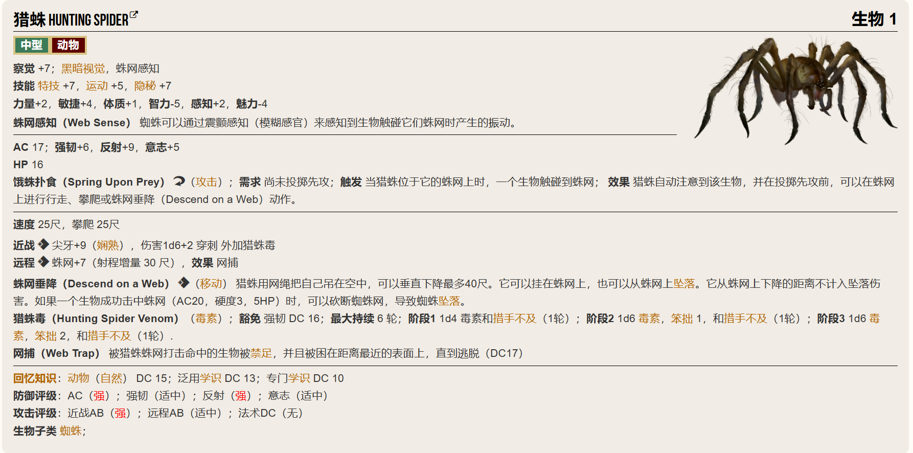 蜘蛛\*3 增加一个精英调整模板 xp120  
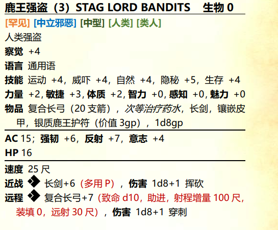 鹿王强盗\*4 增加一个精英调整模板 xp120  
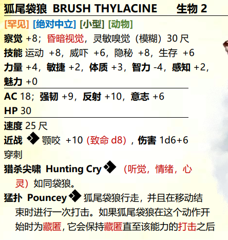 狐尾袋狼\*3 xp120
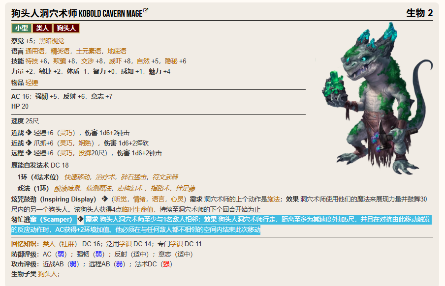 狗头人洞穴术师 \*1
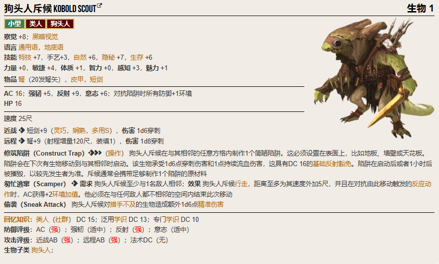 狗头人斥候\*2 增加一个精英调整模板 xp120
 灰熊\*1 增加二个精英调整模板 xp120  
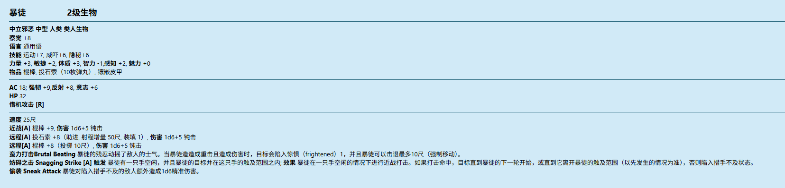 暴徒\*3 xp120
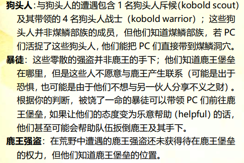

精英调整模板 

XP表  
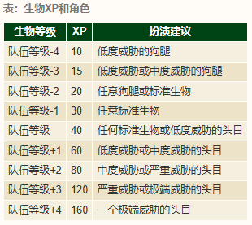

# 地标位置
GB1 布设圈套的空地 (11,2)  
GB2 捕兽人的死尸 (11,3)  
GB3 妖精之巢 (10,3)
GB4 萝卜地 (9,3)
GB5 青蛙池塘 (11,4)

# GB1 布设圈套的空地 (11,2)

你们在这里遇到了很多陷阱，在解决这些陷阱后提示PC们布置这些陷阱的人可能就在附近。

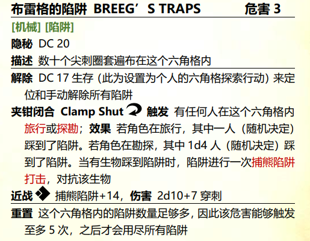

宝藏：每当有 PC 触发陷阱时，该陷阱就被破坏了。若所有陷阱都被解除了，则可以回收足够制作 6 个尖刺圈套（spike snare）的材料。约18gp

# GB2 捕兽人的死尸 (11,3)

你们发现了一具尸体躺在路中间，上面压着一堆圆木。周围也有一些陷阱。

臭名昭著的捕猎人布雷格·奥利范奇，即那个需要为区域 GB1 的陷阱负责的人，设置好了他的最后一个陷阱。此处乍一看好像是布雷格弄巧成拙了，他在布置坠物陷阱的途中不慎误触了机关，导致数根圆木将他压到了地上。实际上，妖精龙佩莱瓦什（Perlivash；详见区域 GB3）已经厌倦了布雷格的残忍，导致了这场过早触发他自己陷阱的“意外”。在搜寻此处时通过 DC 14 的察觉或生存检定可以揭示出有人蓄意切断了坠物陷阱的绳索。大成功能揭示出更多内容：一枚微小、但锋利的牙齿卡在了其中一根绳索上。若有人能成功通过 DC 21 的奥法检定，则能鉴别出这枚牙齿属于妖精龙；它属于佩莱瓦什，而且这件物品可以成为他要为捕猎人之死负责的罪证。  
宝藏：布雷格的短柄斧插在距离他那具伸出手臂的尸体几尺远的树桩上，这是一把寒铁短柄斧(20/2gp)（cold iron hatchet）。树桩旁边是 1 个装满了淡水的水袋和 1 个背包，背包内装着2 日口粮、1 个睡袋、1 捆粗绳、几条亚麻布以及足够制作 359 个尖刺圈套（spike snare）的材料(359/2*3gp)（从这些材料可以看出这很显然和区域 GB1 的那些陷阱均出自同一人之手）。另有 1 捆扎好的包袱内装着 3 块已晾干的海狸皮（c 每块价值 1gp）、1 把剥皮刀和 1 套皮匠工具（leatherworker’s tools）

# GB3 妖精之巢 (10,3)
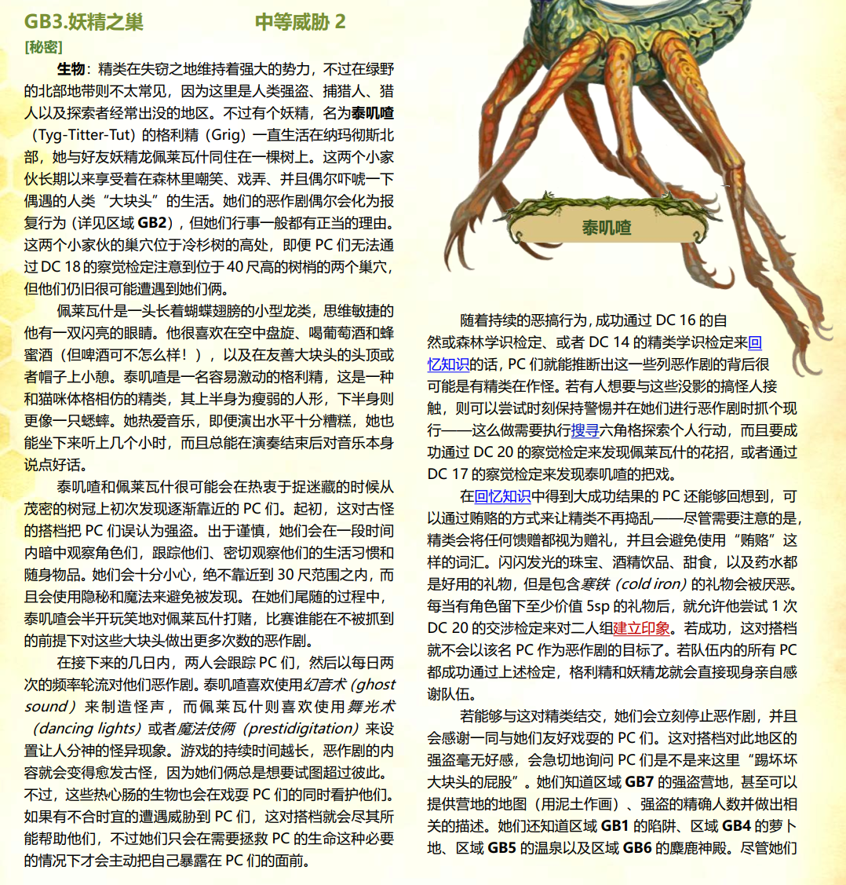
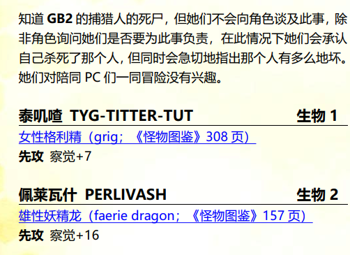
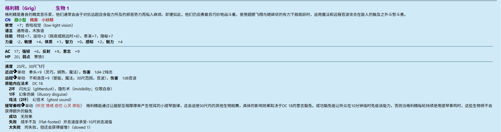 增加一个进化模板
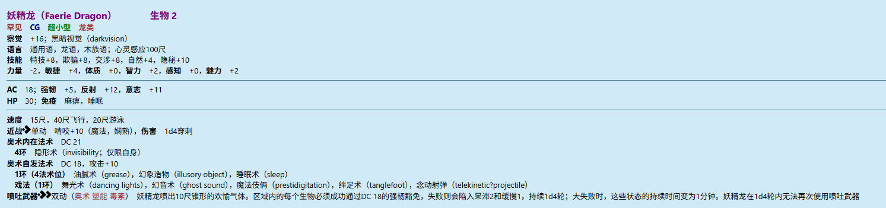 增加一个进化模板

# GB4 萝卜地 (9,3)

一大片美味的月萝卜生长在这片箭头形状的林中空地里。  
生物：月萝卜是本地区狗头人喜爱的美食，当 PC 们首次抵达该区域时，他们会恰好发现四个狗头人仰面躺在萝卜地中间，这几个吃得腹部鼓起来的家伙旁边放着三个装满萝卜的篮子。狗头人因为吃得太多而腹胀，因此在遭遇开始时会陷入恶心 1，但这并不能阻止他们在看到有人靠近时大声尖叫并手脚并用地爬起来。尽管狗头人通常来说胆子都很小，但他们会为了捍卫“自己的”萝卜地而战斗至死。

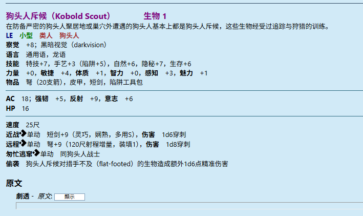 增加一个进化模板 恶心1 狗头人\*4

# GB5 青蛙池塘 (11,4)

臭鼬河（Skunk River）的源头处有两个翻腾着气泡的温泉，使得周围的地区充满了臭鸡蛋的独特气味。尽管味道不尽如人意，但在这里泡温泉还是会让人感到舒适惬意。泉水涌入了附近的溪谷，在河流源头周围成了一处宽阔的沼泽池塘。  
生物：河流的源头处有一座直径为 150 尺的池塘，这里是一对巨蛙的家园；这些生物具有攻击性，会攻击任何靠近其巢穴的存在，但如果巨蛙的生命值降低至 10 点以下，它就会因为恐惧而发出嘶鸣，一头扎进水池里躲藏起来。

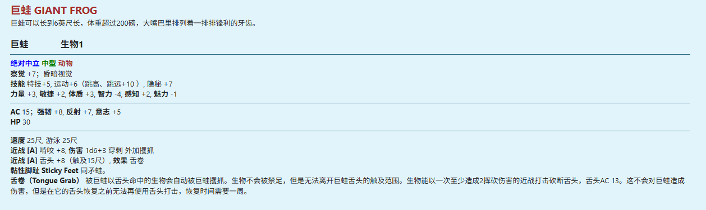 增加一个进化模板 巨蛙\*4